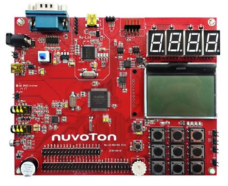

# Nu-LB-NUC140 
NUC140 is a Cortex-M0@50MHz, 128KB Flash ROM, 16K SRAM microcontroller  
*This is a BSP (Board-Support-Package) based on Nu-LB-NUC140_BSP3.00.004 for academic & educational purpose.  *

## Nu-LB-NUC140 : Cortex-M0 learning board

